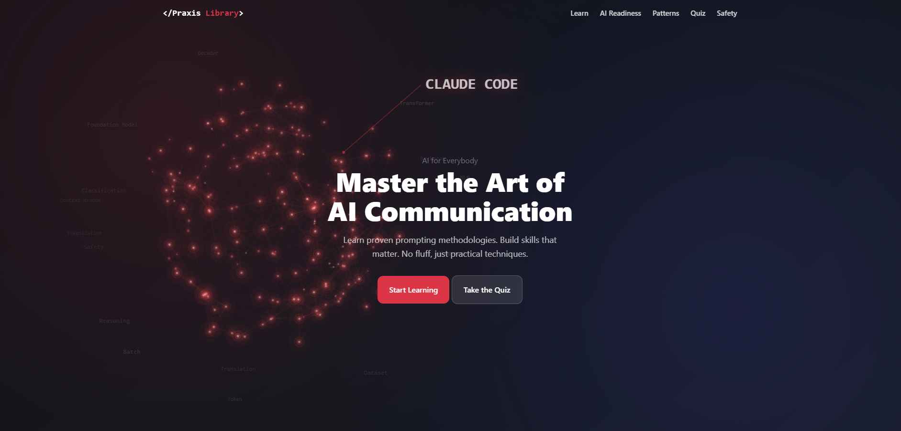

<div align="center"><h1># Praxis Educational Interactive AI Training & Tool Library</h1></div>

<div align="center">

**Your Curiosity - Unlocks Potential - Builds Tomorrow**

*Master the Art of AI Communication theory through proven methodologies and practices*


[](https://github.com/basrosario/PROMPTLIBRARY)



</div>

---

## The Mission

I created this Interactive AI Library because I believe that true innovation in AI isn't just about companies adopting AI as a new technology—it's about **people** learning about, adapting to, and adopting Artificial Intelligence into their daily lives to empower and unlock their own human potential.

$\color{red}{\textsf{Favorite Quote}}$ $\color{white}{\textsf{>>}}$ **"The best way to predict the future is to create it."**

My mission is to demystify AI use and drive personal adoption, with the goal of creating collaborative environments where technology and human creativity combine to solve complex problems and build a better tomorrow.

---

## Development Process: Human + AI Collaboration

This project demonstrates a **systematic, framework-driven approach** to AI-assisted development. Every feature, security implementation, and design decision was created through structured prompting methodologies that are now taught on the site itself.

### The Workflow

```
┌─────────────────────────────────────────────────────────────────────────┐
│                          DEVELOPMENT CYCLE                              │
├─────────────────────────────────────────────────────────────────────────┤
│                                                                         │
│   ┌──────────┐    ┌──────────┐    ┌──────────┐    ┌──────────┐          │
│   │  HUMAN   │───▶│  CLAUDE  │───▶│ VALIDATE │───▶│  REFINE  │───┐    │
│   │  VISION  │    │   CODE   │    │  & TEST  │    │ TOGETHER │     │    │
│   └──────────┘    └──────────┘    └──────────┘    └──────────┘     │    │
│        ▲                                                           │    │
│        └───────────────────────────────────────────────────────────┘    │
│                                                                         │
└─────────────────────────────────────────────────────────────────────────┘
```

| Phase | Human Role | AI Role |
|-------|-----------|---------|
| **Vision** | Define goals, user needs, industry requirements | Structure ideas, suggest architecture |
| **Implementation** | Provide context, validate output | Generate code, apply patterns |
| **Validation** | Security audit, UX testing, performance check | Identify issues, suggest fixes |
| **Refinement** | Final decisions, quality standards | Execute changes consistently |

---

## Prompt Engineering Frameworks Used

This site was built using the same methodologies it teaches. Here's how each framework contributed:

### CRISP Framework
**Context, Role, Instructions, Specifics, Parameters**

Used for quick, focused development tasks:

```
┌─────────────────────────────────────────────────────────────────┐
│ C │ Context       │ Give background                            │
│ R │ Role          │ Tell AI who it is                          │
│ I │ Instructions  │ The main ask                               │
│ S │ Specifics     │ Format, length, tone                       │
│ P │ Parameters    │ Rules and boundaries                       │
└─────────────────────────────────────────────────────────────────┘
```

**Example from this project:**
```
Context: I'm building a prompt engineering learning site with strict
         CSP security requirements. All JavaScript must be in external files.

Role: Act as a senior front-end developer who specializes in secure,
      accessible web applications.

Instructions: Create an interactive quiz component that tracks user
              progress through 10 questions covering AI prompting skills.

Specifics: Use vanilla JavaScript, no frameworks. Store state in a
           single object. Use event delegation for performance.

Parameters: No inline scripts. No external dependencies. Must work
            without JavaScript for basic content. WCAG 2.1 AA compliant.
```

### CRISPE Framework
**Context, Role, Instruction, Specifics, Parameters, Example**

Used for complex features requiring consistent output patterns:

```
┌─────────────────────────────────────────────────────────────────┐
│ C │ Context       │ Give background                            │
│ R │ Role          │ Tell AI who it is                          │
│ I │ Instruction   │ The main ask                               │
│ S │ Specifics     │ Format, length, tone                       │
│ P │ Parameters    │ Rules and boundaries                       │
│ E │ Example       │ Show desired output format                 │
└─────────────────────────────────────────────────────────────────┘
```

**Example from this project:**
```
Context: Building the Prompt Scorer tool that analyzes user prompts
         against framework elements.

Role: Act as a JavaScript developer specializing in text analysis
      and pattern matching.

Instruction: Create a scoring algorithm that detects CRISP, COSTAR,
             and CRISPE elements in user prompts.

Specifics: Use regex patterns. Weight framework coverage at 50%,
           sentence quality at 25%, intent clarity at 25%.

Parameters: Must be client-side only. No API calls. Debounce any
            real-time analysis. Handle edge cases gracefully.

Example:
  Input: "Write about marketing"
  Output: { score: 25, elements: { I: true }, missing: [C,R,S,P] }

  Input: "Context: I run a business. Write a 500-word blog..."
  Output: { score: 85, elements: { C: true, I: true, S: true, P: true } }
```

### COSTAR Framework
**Context, Objective, Style, Tone, Audience, Response**

Used for content-heavy pages where audience matters:

```
┌─────────────────────────────────────────────────────────────────┐
│ C │ Context    │ Situation background                          │
│ O │ Objective  │ Goal to achieve                               │
│ S │ Style      │ Writing style                                 │
│ T │ Tone       │ Emotional quality                             │
│ A │ Audience   │ Who will read it                              │
│ R │ Response   │ Desired format                                │
└─────────────────────────────────────────────────────────────────┘
```

**Example from this project:**
```
Context: Creating educational content about AI safety for the
         learning site.

Objective: Help users understand AI limitations, hallucinations,
           and verification practices without causing fear.

Style: Clear, practical, evidence-based. Like a helpful teacher.

Tone: Empowering but cautious. Acknowledge risks without alarmism.

Audience: General public, beginners to intermediate AI users,
          non-technical professionals.

Response: Structured page with collapsible sections, real-world
          examples, and actionable verification prompts.
```

### ReAct Framework
**Reasoning + Acting**

Used for complex debugging, auditing, and multi-step investigations:

```
┌─────────────────────────────────────────────────────────────────┐
│         ReAct: Thought → Action → Observation → Repeat          │
├─────────────────────────────────────────────────────────────────┤
│                                                                 │
│   Thought:  "There's a consistency issue across framework       │
│              definitions. Need to scan the entire site."        │
│                                                                 │
│   Action:   Search for all CRISP/CRISPE references              │
│             grep -r "CRISP" --include="*.html" --include="*.js" │
│                                                                 │
│   Observation: Found 15 files with references. 3 have           │
│                incorrect definitions.                           │
│                                                                 │
│   Thought:  "Need to check each file individually and           │
│              catalog all discrepancies before fixing."          │
│                                                                 │
│   [Continue until complete...]                                  │
│                                                                 │
└─────────────────────────────────────────────────────────────────┘
```

**Used for:**
- Security audit across 26+ pages
- Framework consistency verification
- Performance optimization analysis
- Accessibility compliance review

---

## Security Architecture

### Defense in Depth: 100% Security Score

This site achieves **A+ 100% security rating** through multiple layers of protection:

```
┌─────────────────────────────────────────────────────────────────────────┐
│                        SECURITY LAYERS                                  │
├─────────────────────────────────────────────────────────────────────────┤
│                                                                         │
│  Layer 1: Content Security Policy (CSP)                                 │
│  ├── default-src 'none'           → Block everything by default        │
│  ├── script-src 'self'            → Only local scripts                 │
│  ├── style-src 'self'             → Only local styles                  │
│  ├── img-src 'self' data:         → Local images + data URIs           │
│  ├── font-src 'self'              → Self-hosted fonts only             │
│  ├── connect-src 'self'           → Same-origin connections            │
│  ├── form-action 'none'           → Block all form submissions         │
│  └── base-uri 'none'              → Prevent base tag hijacking         │
│                                                                         │
│  Layer 2: Transport Security                                            │
│  ├── Strict-Transport-Security    → Force HTTPS (1 year, preload)      │
│  └── Upgrade-Insecure-Requests    → Auto-upgrade HTTP to HTTPS         │
│                                                                         │
│  Layer 3: Frame Protection                                              │
│  ├── X-Frame-Options: DENY        → Prevent clickjacking               │
│  └── frame-ancestors 'none'       → CSP frame protection               │
│                                                                         │
│  Layer 4: Content Protection                                            │
│  ├── X-Content-Type-Options       → Prevent MIME sniffing              │
│  └── X-XSS-Protection             → Legacy XSS filter                  │
│                                                                         │
│  Layer 5: Privacy                                                       │
│  ├── Referrer-Policy              → strict-origin-when-cross-origin    │
│  └── Permissions-Policy           → Disable unnecessary APIs           │
│                                                                         │
│  Layer 6: Server Configuration                                          │
│  ├── Directory browsing disabled  → Options -Indexes                   │
│  ├── Sensitive files blocked      → .htaccess, .git, .env              │
│  └── Error document handling      → Custom 404/403 pages               │
│                                                                         │
└─────────────────────────────────────────────────────────────────────────┘
```

### Zero External Dependencies

| What We Avoided | Why It Matters |
|-----------------|----------------|
| CDN-hosted JavaScript | No supply chain attacks |
| External fonts (Google Fonts) | No tracking, no external requests |
| Third-party analytics | No data leakage |
| External APIs | No dependency on third-party uptime |
| Inline scripts/styles | CSP 'self' enforcement |

### Security Headers Implementation

**HTML Meta Tags (per page):**
```html
<meta http-equiv="Content-Security-Policy"
      content="default-src 'none';
               connect-src 'self';
               form-action 'none';
               base-uri 'none';
               font-src 'self';
               img-src 'self' data:;
               style-src 'self';
               script-src 'self';">

<meta name="referrer" content="strict-origin-when-cross-origin">
```

**Server Configuration (.htaccess):**
```apache
# Complete Security Headers
Header set Content-Security-Policy "default-src 'none'; script-src 'self'; style-src 'self'; img-src 'self' data:; font-src 'self'; connect-src 'self'; form-action 'none'; base-uri 'none'; frame-ancestors 'none';"
Header set Strict-Transport-Security "max-age=31536000; includeSubDomains; preload"
Header set X-Content-Type-Options "nosniff"
Header set X-Frame-Options "DENY"
Header set X-XSS-Protection "1; mode=block"
Header set Referrer-Policy "strict-origin-when-cross-origin"
Header set Permissions-Policy "accelerometer=(), camera=(), geolocation=(), gyroscope=(), magnetometer=(), microphone=(), payment=(), usb=()"
```

### Security Audit Results

| Test | Tool | Result |
|------|------|--------|
| Security Headers | securityheaders.com | **A+** |
| Mozilla Observatory | observatory.mozilla.org | **A+** |
| SSL Labs | ssllabs.com | **A+** |
| CSP Evaluator | csp-evaluator.withgoogle.com | **Pass** |

---

## Technical Specifications

### Architecture

```
┌─────────────────────────────────────────────────────────────────────────┐
│                         PROJECT STRUCTURE                               │
├─────────────────────────────────────────────────────────────────────────┤
│                                                                         │
│  praxis-library/                                                        │
│  ├── index.html                    # Homepage                           │
│  ├── styles.css                    # Single stylesheet (4000+ lines)    │
│  ├── app.js                        # Single script (2000+ lines)        │
│  ├── .htaccess                     # Server security config             │
│  │                                                                      │
│  ├── learn/                        # Educational content                │
│  │   ├── index.html                # Learning hub                       │
│  │   ├── prompt-basics.html        # Fundamentals                       │
│  │   ├── crisp.html                # CRISP methodology                  │
│  │   ├── crispe.html               # CRISPE methodology                 │
│  │   ├── costar.html               # COSTAR methodology                 │
│  │   ├── react.html                # ReAct methodology                  │
│  │   └── advanced.html             # Advanced techniques                │
│  │                                                                      │
│  ├── tools/                        # Interactive tools                  │
│  │   ├── index.html                # Tools hub                          │
│  │   ├── scorer.html               # Prompt Scorer                      │
│  │   ├── checklist.html            # Preflight Checklist                │
│  │   └── hallucination.html        # Hallucination Spotter              │
│  │                                                                      │
│  ├── patterns/                     # Prompt patterns library            │
│  ├── quiz/                         # AI Readiness Quiz                  │
│  ├── education/                    # Education industry                 │
│  ├── business/                     # Business industry                  │
│  ├── services/                     # Services industry                  │
│  ├── pages/                        # Static pages                       │
│  │                                                                      │
│  └── assets/                       # Static resources                   │
│      ├── fonts/                    # Self-hosted (Inter, JetBrains)     │
│      ├── icons/SVG/                # 50+ vector icons                   │
│      └── images/                   # Optimized images                   │
│                                                                         │
└─────────────────────────────────────────────────────────────────────────┘
```

### Performance Metrics

| Metric | Value | Method |
|--------|-------|--------|
| First Contentful Paint | < 1.0s | Lighthouse |
| Largest Contentful Paint | < 2.0s | Lighthouse |
| Total Blocking Time | < 100ms | Lighthouse |
| Cumulative Layout Shift | < 0.1 | Lighthouse |
| Performance Score | **100** | Lighthouse |

### Accessibility Compliance

| Standard | Status |
|----------|--------|
| WCAG 2.1 Level AA | Compliant |
| Section 508 | Compliant |
| Keyboard Navigation | Full support |
| Screen Reader | Optimized |
| Color Contrast | 4.5:1+ ratios |
| Focus Indicators | Visible on all elements |

---

## Development Tools

### Primary Stack

| Tool | Purpose | Why Chosen |
|------|---------|------------|
| **VS Code** | Code editor | Extensions, integrated terminal |
| **Claude Code** | AI assistant | Deep code understanding, security awareness |
| **Git** | Version control | Standard, GitHub integration |
| **Live Server** | Local development | Hot reload, HTTPS support |

### VS Code Extensions Used

```json
{
  "recommendations": [
    "ritwickdey.LiveServer",
    "esbenp.prettier-vscode",
    "formulahendry.auto-close-tag",
    "formulahendry.auto-rename-tag",
    "ecmel.vscode-html-css",
    "eamodio.gitlens",
    "streetsidesoftware.code-spell-checker"
  ]
}
```

### Claude Code Configuration

```json
{
  "permissions": {
    "allow": [
      "Read(**)",
      "Edit(**)",
      "Write(assets/**)",
      "Bash(git status)",
      "Bash(git diff)",
      "Bash(git add *)",
      "Bash(git commit *)"
    ],
    "deny": [
      "Bash(rm -rf *)",
      "Bash(git push *)"
    ]
  }
}
```

---

## Session Continuity & Workflow Automation

### The Problem

AI conversations have context limits. Long development sessions get cut off, and starting fresh means re-explaining constraints, project structure, and current progress every time. This creates inefficiency and risks inconsistency.

### The Solution: Document-Driven Automation

We built a system of interconnected documents that Claude Code reads automatically, ensuring every session starts with full context.

```
┌─────────────────────────────────────────────────────────────────────────┐
│                    AUTOMATED CONTEXT LOADING                            │
├─────────────────────────────────────────────────────────────────────────┤
│                                                                         │
│  ┌─────────────┐                                                        │
│  │  CLAUDE.md  │ ◄── Auto-loaded at session start                       │
│  │  (Root)     │     Contains: Rules summary, file references           │
│  └──────┬──────┘                                                        │
│         │                                                               │
│         ▼                                                               │
│  ┌─────────────┐     ┌─────────────────────────────┐                    │
│  │ HANDOFF.md  │────▶│ praxis-enhancement-plan.md  │                    │
│  │ (State)     │     │ (Full Plan)                 │                    │
│  └─────────────┘     └─────────────────────────────┘                    │
│                                                                         │
│  Result: Every new session has full project context automatically       │
│                                                                         │
└─────────────────────────────────────────────────────────────────────────┘
```

### File Purposes

| File | Location | Purpose | Update Frequency |
|------|----------|---------|------------------|
| `CLAUDE.md` | Project root | Auto-loaded rules & references | Rarely (stable rules) |
| `HANDOFF.md` | `.claude/` | Current state, progress, context | Every session |
| `praxis-enhancement-plan.md` | `.claude/plans/` | Full phase details, decisions | Per phase |
| `HANDOFF-PROMPT.md` | `.claude/` | Manual backup prompt | Never (backup only) |

### What CLAUDE.md Contains

This file loads automatically at every session start:

```markdown
# Praxis Project Instructions

## Required Reading
Before making ANY changes, read these files:
1. `.claude/HANDOFF.md` - Current state, rules, and progress
2. `.claude/plans/praxis-enhancement-plan.md` - Master plan

## Critical Rules (Always Follow)
- NO inline styles (CSP compliance)
- NO inline scripts (CSP compliance)
- NO external resources
- All styles in styles.css
- All scripts in app.js with defer

## Code Notation (Required)
HTML:  <!-- === SECTION === --> ... <!-- /SECTION -->
CSS:   /* === SECTION === */
JS:    // === SECTION === with JSDoc comments
```

### What HANDOFF.md Tracks

Updated at the end of each session:

```markdown
## Current Progress

### Phase 1: Badge Relocation - IN PROGRESS
| Task | Status |
|------|--------|
| 1.1 Remove header badges | ✅ Done |
| 1.2 Remove mobile badges | ✅ Done |
| 1.3 Add home page badges | ✅ Done |
| 1.4 Add learn page badges | ⏳ Pending |

## Key Context
- Badge component: `.content-badges` in styles.css line 506
- Hero text updated to: "Master the Art of AI Interactions"
- CSS max-width adjusted to 600px for subtitle
```

### Code Notation Standards

All code must be documented for maintainability:

**HTML Regions:**
```html
<!-- =============================================
     HERO SECTION - Main landing area with badges
     ============================================= -->
<section class="hero">
    <!-- Content badges row -->
    <div class="content-badges">...</div>
</section>
<!-- /HERO SECTION -->
```

**CSS Sections:**
```css
/* ==============================================
   CONTENT BADGES
   Inline badge display for content areas
   ============================================== */

/* Badge container - flexbox centered
   -------------------------------------------- */
.content-badges {
    display: flex;
    justify-content: center;
    gap: 0.5rem;
}

/* Badge - Individual item with label/value */
.content-badge { }

/* Badge - Claude variant (orange gradient) */
.content-badge--claude .badge-value {
    background: linear-gradient(135deg, #F97316, #EA580C);
}
```

**JavaScript Functions:**
```javascript
// ==============================================
// PROMPT ANALYZER
// Detects framework elements in user prompts
// ==============================================

/**
 * Analyzes prompt text for framework elements
 * @param {string} promptText - User's prompt to analyze
 * @param {string} framework - Target framework (CRISP, COSTAR, etc.)
 * @returns {Object} - Detection results with scores
 */
function analyzePrompt(promptText, framework) {
    // Use regex patterns for natural language detection
    const results = detectElements(promptText, framework);
    return calculateScore(results);
}
```

### Why This Works

| Challenge | Solution |
|-----------|----------|
| Context limits | Documents persist across sessions |
| Inconsistent rules | CLAUDE.md enforces standards |
| Lost progress | HANDOFF.md tracks state |
| Forgotten decisions | Plan documents decisions |
| Unclear code | Notation standards require documentation |

### The Constraint-Driven Approach

Every constraint has a documented resolution:

| Constraint | Resolution | Documentation |
|------------|------------|---------------|
| No inline styles | External styles.css only | CSP rules in CLAUDE.md |
| No inline scripts | External app.js with defer | CSP rules in CLAUDE.md |
| No external resources | Self-hosted fonts, no CDNs | Security section in plan |
| Session limits | Auto-loading CLAUDE.md | This workflow |
| Code readability | Mandatory notation | Notation standards |

### Reproducing This Workflow

1. **Create CLAUDE.md in project root** - Contains rules that auto-load
2. **Create .claude/HANDOFF.md** - Track current state and progress
3. **Create .claude/plans/ directory** - Store detailed plans
4. **Update HANDOFF.md each session** - Keep context current
5. **Follow notation standards** - Document all code sections

```bash
# Directory structure
your-project/
├── CLAUDE.md                    # Auto-loaded every session
├── .claude/
│   ├── HANDOFF.md              # Current state (update often)
│   ├── HANDOFF-PROMPT.md       # Manual backup
│   └── plans/
│       └── your-plan.md        # Full project plan
```

---

## Quality Assurance Process

### Validation Workflow

```
┌───────────────────────────────────────────────────────────────────────┐
│                      QA VALIDATION PIPELINE                           │
├───────────────────────────────────────────────────────────────────────┤
│                                                                       │
│  ┌────────────┐   ┌────────────┐   ┌─────────────┐   ┌────────────┐  │
│  │  Security  │──▶│ Performance│──▶│ Accessibility│──▶│     UX     │  │
│  │   Audit    │   │    Test    │   │    Check    │   │   Review   │  │
│  └────────────┘   └────────────┘   └─────────────┘   └────────────┘  │
│        │                │                │                 │          │
│        ▼                ▼                ▼                 ▼          │
│  ┌────────────┐   ┌────────────┐   ┌─────────────┐   ┌────────────┐  │
│  │ CSP Check  │   │ Lighthouse │   │    WAVE     │   │   Manual   │  │
│  │ Header Test│   │ Core Vitals│   │   axe-core  │   │   Testing  │  │
│  └────────────┘   └────────────┘   └─────────────┘   └────────────┘  │
│                                                                       │
└───────────────────────────────────────────────────────────────────────┘
```

### Consistency Verification

Used **ReAct framework** to systematically audit all 26+ pages:

1. **Thought**: Framework definitions must be consistent
2. **Action**: Grep search for all CRISP/CRISPE/COSTAR references
3. **Observation**: Catalog discrepancies
4. **Repeat**: Fix and verify each issue

---

## Lessons Learned

### What Works

| Practice | Benefit |
|----------|---------|
| Structured prompts (CRISP/CRISPE) | Consistent, predictable output |
| Framework-driven development | Reduced cognitive load |
| Security-first approach | Zero vulnerabilities |
| Human validation loop | Catches AI errors early |
| Single source files | Easier maintenance |

### What to Avoid

| Anti-Pattern | Why It Fails |
|--------------|--------------|
| Vague prompts | Inconsistent results |
| Skipping validation | Security gaps |
| Over-reliance on AI | Missing human judgment |
| External dependencies | Security/privacy risks |
| Inline code | CSP violations |

---

## Reproducibility

Want to build something similar? Here's the exact process:

### 1. Set Up Your Environment

```bash
# Clone this repo for reference
git clone https://github.com/basrosario/PROMPTLIBRARY.git

# Install Claude Code
npm install -g @anthropic-ai/claude-code

# Start development
cd your-project
claude
```

### 2. Use Structured Prompts

Start every significant task with a framework:

- **CRISP** for quick tasks
- **CRISPE** when you need examples
- **COSTAR** for content-heavy work
- **ReAct** for debugging/auditing

### 3. Validate Everything

Run these checks before deploying:

```bash
# Security
curl -I https://yoursite.com | grep -i "security\|content-security"

# Performance
npx lighthouse https://yoursite.com --view

# Accessibility
npx axe https://yoursite.com
```

### 4. Iterate and Improve

The human-AI loop:
1. You define the goal
2. AI generates implementation
3. You validate and test
4. AI refines based on feedback
5. Repeat until perfect

---

## Resources

### Frameworks Taught on This Site

| Framework | Best For | Learn More |
|-----------|----------|------------|
| CRISP | Quick tasks | [/learn/crisp.html](learn/crisp.html) |
| CRISPE | Complex with examples | [/learn/crispe.html](learn/crispe.html) |
| COSTAR | Content creation | [/learn/costar.html](learn/costar.html) |
| ReAct | Problem-solving | [/learn/react.html](learn/react.html) |

### External Resources

- [Claude Code Documentation](https://docs.anthropic.com/claude-code)
- [MDN Web Security](https://developer.mozilla.org/en-US/docs/Web/Security)
- [OWASP Security Headers](https://owasp.org/www-project-secure-headers/)
- [Web Content Accessibility Guidelines](https://www.w3.org/WAI/WCAG21/quickref/)

---

## License

**Creative Commons Attribution-NonCommercial 4.0 International (CC BY-NC 4.0)**

You may use this as a learning resource, build your own version, and share with attribution. Commercial use requires permission.

See [LICENSE](LICENSE) for full terms.

---

<div align="center">

**Praxis Interactive AI Library**

*Human creativity. AI capability. Better outcomes.*

*The future belongs to those who learn to work alongside AI.*

---

**Built with structured prompting. Validated by humans. Secured for everyone.**

</div>
